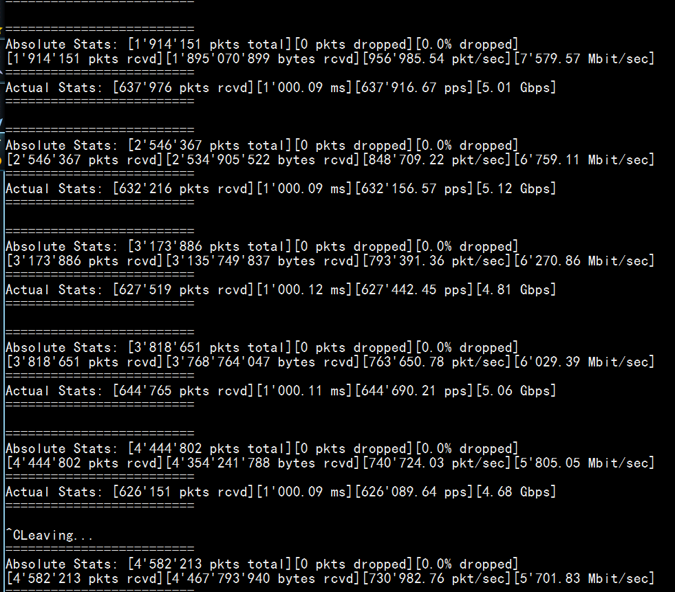
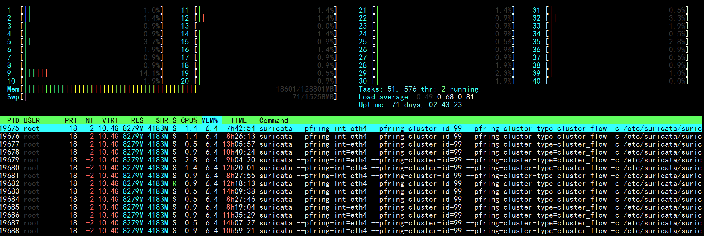
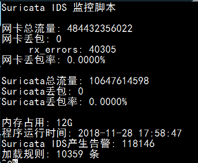

# Suricata部署优化

此文章记录了我在18年部署Suricata时的一些经验与心得

硬件配置
--------
CPU：双路e5  
内存：128G  
硬盘：越多越好  
网卡：管理口：千兆网卡，镜像口：intel 万兆网卡  
系统：Debian GNU/Linux 8.11 (jessie)  
内核版本：3.16.0-6-amd64  
IDS：suricata 4.0.5 
告警分析：splunk  
规则自动更新：suricata-update    

挂载硬盘
--------
传统分区不能挂载超过2t的硬盘，这里使用的raid 容量12t所以必须将其转换为gpt分区才行不然会有以下错误  

```The size of this disk is  DOS partition table format can not be used on drives for volumes larger than 2199023255040 bytes for 512-byte sectors. Use GUID partition table format (GPT).```  

硬盘设置
```
parted /dev/sdb 	选择第二块硬盘
(parted) mklabel 	创建分区表
New disk label type?  [msdos]? Gpt
(parted) mkpart
Partition name?  []? disk1   #为新建的分区命名
File system type?  [ext2]? ext4   #设置文件系统格式为ext4
Start? 0                           #分区开始硬盘大小
End? 2345.3GB #分区结束硬盘大小，支持mb、gb、tb
(parted) print   #查看分区信息
mkfs -t ext4 -c /dev/sdb1#格式化
mkdir /data#创建数据目录
mount /dev/sdb1 /data#挂载硬盘
sudo fdisk –l
vim /etc/fstab   #开机自动挂载第二块硬盘
UUID=xxxx-xxxx-xxxx-xxxx-xxxx /data           ext4    defaults        0       2 
```

网卡驱动
--------
在选择万兆网卡时最好使用intel的网卡，pfring ZC自带了intel网卡全套驱动，兼容性与性能最好  
驱动下载地址 https://sourceforge.net/projects/e1000/files/  
```
1 Gbit
e1000e (RX and TX)
igb (RX and TX)
10 Gbit
ixgbe (RX and TX)
10/40 Gbit
i40e (RX and TX)
10/40/100 Gbit
fm10k (RX and TX)
```
查看网卡硬件  
```lspci -vvv | grep Ethernet```  
这里使用的是万兆x520网卡下载最新的ixgbe驱动  
```
tar xzvf ixgbe-5.0.4.tar.gz
cd ixgbe-5.0.4/src
make
sudo make install         
sudo insmod ./ixgbe         加载驱动
sudo modprobe ixgbe RSS = 4,4   加载驱动时设置参数  
sudo modinfo ixgbe                 查看驱动信息
sudo rmmod ixgbe         删除驱动
加载ixgbe网卡时优化参数
modprobe ixgbe MQ=0,0 RSS=1,1 VMDQ=0,0 InterruptThrottleRate=12500,12500 FCoE=0,0 LRO=0,0
```  
镜像接口配置
--------
桌面版本的Debian会有2个网络管理程序，networking与network-manager优先级不同，服务器需要禁用network-manager否则interfaces不起作用  

```
vim /etc/network/interfaces
auto eth5
```
分配一个无ip的接口
```
iface eth5 inet manual                
up ifconfig $IFACE -arp up
```
开启混杂模式
```
up ip link set $IFACE promisc on         
down ip link set $IFACE promisc off
down ifconfig $IFACE down
```
禁用掉不必要的功能
```
#post-up for i in rx tx sg tso ufo gso gro lro; do ethtool -K $IFACE $i off; done 
```        
禁用掉ipv6
```
post-up echo 1 > /proc/sys/net/ipv6/conf/$IFACE/disable_ipv6                
/etc/init.d/networking restart
```
Suricata安装编译
--------
安装依赖库
```
apt-get -y install libpcre3 libpcre3-dbg libpcre3-dev \
build-essential autoconf automake libtool libpcap-dev libnet1-dev \
libyaml-0-2 libyaml-dev zlib1g zlib1g-dev libmagic-dev libcap-ng-dev \
libjansson-dev pkg-config

apt-get install libgeoip1 libgeoip-dev
```
下载安装包  
```
wget https://www.openinfosecfoundation.org/download/suricata-4.0.5.tar.gz  
tar -zxvf suricata-4.0.5.tar.gz 
``` 
Hyperscan安装
```
apt-get install cmake ragel libboost-dev python-dev libbz2-dev
wget http://downloads.sourceforge.net/project/boost/boost/1.60.0/boost_1_60_0.tar.gz
tar xvzf boost_1_60_0.tar.gz
ln -s /opt/hyperscan/build/boost_1_60_0/boost /opt/hyperscan/include/boost
cd /opt
git clone https://github.com/01org/hyperscan
cd hyperscan
mkdir build
cd build
cmake -DBUILD_STATIC_AND_SHARED=1 ../
make && make install
suricata --build-info|grep Hyperscan
```
安装pfring  
```
apt-get install build-essential bison flex linux-headers-$(uname -r)
https://sourceforge.net/projects/ntop/files/PF_RING/PF_RING-6.6.0.tar.gz/download
cd /opt/PFring 
make
cd kernel
make install
	如果提示make[1]: *** /lib/modules/3.16.0-6-amd64/build: No such file or directory.  Stop.
	则需要 安装内核头 apt install linux-headers-3.16.0-6-amd64
cd ../userland/lib
./configure –prefix=/usr/local/pfring  &&  make install
cd /opt/PF_RING-6.6.0/userland/libpcap-1.7.4
./configure && make install 
sudo ldconfig
sudo modprobe pf_ring
```  
从github中安装
```
git clone https://github.com/ntop/PF_RING.git 
cd PF_RING / kernel 
make 
sudo insmod ./pf_ring.ko 
cd ../userland 
make
modprobe pf_ring  transparent_mode=1 enable_tx_capture=0 min_num_slots=65534 quick_mode=1 
modinfo pf_ring
```
安装Lua-jit
```
http://luajit.org/download/LuaJIT-2.0.4.tar.gz
tar -zxvf LuaJIT-2.0.4.tar.gz
cd LuaJIT-2.0.4
make && make install 
```
开始编译
```
./configure --prefix=/usr --sysconfdir=/etc --localstatedir=/var --enable-pfring --with-libpfring-includes=/usr/local/pfring/include --with-libpfring-libraries=/usr/local/pfring/lib --enable-geoip  --enable-luajit --with-libluajit-includes=/usr/local/include/luajit-2.0/ --with-libluajit-libraries=/usr/local/lib/ --with-libhs-includes=/usr/local/include/hs/ --with-libhs-libraries=/usr/local/lib/ --enable-profiling
make clean && make && make install && ldconfig
make install-conf
```

日志轮训
--------
suricata通过logrotate配置日志轮训，bro自带broctl已经包括日志轮训
```
vim /etc/logrotate.d/suricata
/data/suricata/eve.json {
   daily
   rotate 30
   olddir /data/suricata/old/
   compress
   missingok
   notifempty
   dateext
   postrotate
   /bin/kill -HUP $(cat /var/run/suricata.pid)
   endscript
}
```
强制执行，测试是否配置成功  
```sudo logrotate -f /etc/logrotate.d/suricata ```  
每天自动执行
```
cat /etc/cron.daily/logrotate
#!/bin/sh
test -x /usr/sbin/logrotate || exit 0
/usr/sbin/logrotate /etc/logrotate.conf
```

配置splunk
--------
```
从官网下载splunk 需要注册用户，splunk免费版每天只能导入500MB数据
dpkg -i splunk.deb
安装完成后会在/opt/splunk目录中，进入/opt/splunk/bin  ./splunk start --accept-license  启动splunk
安装suricata 插件到splunk
下载https://github.com/jorritfolmer/TA-suricata
应用--管理应用--从文件中安装，选择下载的zip文件导入
设置--数据输入--文件 & 目录
添加监控/data/suricata/eve.json 文件，来源类型：suricata_eve 	
索引新建alert 	app选择TA-suricata-master 
```

Ethtool工具
--------
ethtool工具主要用来查看与设置网卡信息，一般小写字母是查看网卡信息，大写字母是修改网卡信息。例如-g 查看 网卡ring大小，-G 修改  
ethtool –S ethx  查看网卡状态主要是接收字节、丢包或者接收错误  
ethtool –g ethx  查看网卡ring buffer  
ethtool –l eth4   查看网卡RSS队列  
ethtool –L eth4 combined 1    将网卡队列设置为1  
ethtool –k eth4     查看协议卸载功能  

网卡丢包优化
--------
丢包主要是网卡丢包或者内核丢包，网卡丢包在ifconfig里面就可以看到，具体原因还得通过ethtool来定位  
#### 查看网卡具体丢包原因
```
sudo ethtool -S eth4 |ag 'error|drop'
rx_errors: 584
tx_errors: 0
rx_dropped: 0
tx_dropped: 0
rx_over_errors: 0
rx_crc_errors: 0
rx_frame_errors: 0
rx_fifo_errors: 0
# 之前遇到rx_missed_errors疯狂上涨，这种情况一般是网卡缓冲区满了，多余的数据会被丢弃。与网卡ring buffer和rss队列有关
rx_missed_errors: 0
tx_aborted_errors: 0
tx_carrier_errors: 0
tx_fifo_errors: 0
```
#### 网卡优化
```
sudo ethtool -K eth4 rx off
sudo ethtool -K eth4 tx off
sudo ethtool -K eth4 sg off
sudo ethtool -K eth4 tso off
sudo ethtool -K eth4 gso off
sudo ethtool -K eth4 gro off
sudo ethtool -K eth4 lro off
sudo ethtool -K eth4 rxvlan off
sudo ethtool -K eth4 txvlan off
sudo ethtool -K eth4 ntuple off
sudo ethtool -K eth4 rxhash off
sudo ethtool -A eth4 rx off tx off
```
网卡RSS队列，对于ids设备来说 影响性能，默认cpu有多少核心就会有多少队列数，如果设置为1导致rx_missed_errors可以改成2  
```sudo ethtool -L eth4 combined 1```  
巨型帧 将最大传输单元增加到9000 默认1500 ,数据包越小产生的CPU中断越多  
```sudo ifconfig eth4 mtu 9000```  
网卡ring buffer 的值并非越大越好 这里将原来4096降到512  
```sudo ethtool -g rx 512```  
我们需要对程序设置cpu绑定，例如40个核心 0-38，39分给suricata 最后一个负责处理网卡中断  
```
./set_irq_affinity.sh 39 eth3
查看网卡中断，现在可以看到设置后由原来的CPU0处理变成了最后一个CPU39在处理中断
cat /proc/interrupts|ag eth4
```
pf_ring && ZC 内核旁路
--------
pfring是linux下高速数据包捕获库用来代替libpcap  

pf_ring主要分为开源免费版与pfring ZC 商业版本（收费1000+rmb左右，按照网卡mac地址绑定），老版本还有pfring DNA  

理论上性能pf_ring ZC>af_packet~pf_ring>libpcap  

一般来讲，丢包的主要原因主要在于 1.频繁产生中断（网卡接收到数据通过中断通知cpu处理） 2、数据需要多次拷贝，从网卡--》内核空间--》用户空间  

Linux NAPI的方式采用了中断+轮训，网卡触发的中断会变少。
PF_RING ZC采用了内核旁路的方式，绕过内核协议栈直接进入用户态，极大提升了处理性能。  

官网地址：https://www.ntop.org/products/packet-capture/pf_ring/  
github：https://github.com/ntop/PF_RING  

安装
``` 
cd PF_RING/drivers/ZC/intel/ixgbe/ixgbe-*-zc/src/
make && sudo ./load_driver.sh
```
加载PF-ring时优化参数  
```
modprobe pf_ring transparent_mode=0 enable_tx_capture=0 min_num_slots=65534
千万不能设置quick_mode=1，不然suricata会报错，开启了这个模式只能允许一个抓包进程
```  
测试ZC模式是否配置完成，如果驱动没有加载会显示没有找到设备
```
sudo pfcount -i zc:eth0   
modinfo pf_ring
```
查看pf_ring 设备信息，如果使用了pfring zc Polling Mode字段会显示NAPI/ZC
```
cat /proc/net/pf_ring/dev/eth0
Name:         eth0
Index:        23
Address:      xx:xx:xx:xx:xx:xx
Polling Mode: NAPI
Type:         Ethernet
Family:       Standard NIC
# Bound Sockets:  51
TX Queues:    2
RX Queues:    2
```
每开启一个抓包进程，就会在/proc/net/pf_ring目录下生成一个xxxxx-ethX.xxx文件，这里面主要看Tot Packets 这个是总共接收的包，Tot Pkt Lost是指丢弃的包
```
cat /proc/net/pf_ring/xxxxx-ethX.xxx
Appl. Name             : bro
Tot Packets            : 19085985414
Tot Pkt Lost           : 0
```
内核参数优化
--------
```
sudo sysctl net.core.rmem_default=73400320
sudo sysctl net.core.wmem_max=134217728
sudo sysctl net.core.rmem_max=134217728
sudo sysctl net.core.netdev_max_backlog=300000
sudo sysctl net.ipv4.tcp_no_metrics_save=1
sudo sysctl net.ipv4.tcp_congestion_control=htcp
sudo sysctl net.ipv4.tcp_mtu_probing=1
sudo sysctl net.ipv4.tcp_rmem="100000000 100000000 100000000"
sudo sysctl net.ipv4.tcp_wmem="100000000 100000000 100000000"
sudo sysctl net.ipv4.tcp_mem="100000000 100000000 100000000"
sudo sysctl net.core.netdev_budget=3000
sudo sysctl -p
```
suricata 10GBit环境 配置优化
-------
```
# 设置内部网络地址范围
vars:
address-groups:
HOME_NET: "[192.168.0.0/16,10.0.0.0/8,172.16.0.0/12]"
EXTERNAL_NET: "any"
# 协议这块，将不需要的全部关闭，如果这里没有启用，规则里面又有相关协议规则会报错。
app-layer:
    protocols:
        dcerpc:
            enabled: no
        ssh:
            enabled: no
        smtp:
            enabled: no
        imap:
            enabled: no
        msn:
            enabled: no
        smb:
            enabled: detection-only
            detection-ports:
            dp: 139, 445
        nfs:
            enabled: no
        tftp:
             enabled: no
        modbus:
             enabled: no
        dnp3:
             enabled: no
        enip:
             enabled: no
        ntp:
             enabled: no
# suricata 能够同时处理多少个数据包
max-pending-packets: 8192
runmode: workers
defrag:
    memcap: 20gb
    imeout: 3
flow:
    memcap: 8gb
    hash-size: 50000
    prealloc: 50000
    emergency-recovery: 30
# 流超时信息设置，将原来的数值调小
flow-timeouts:
default:
    new: 5
    established: 60
    closed: 3
    bypassed: 30
    emergency-new: 10
    emergency-established: 30
    emergency-closed: 0
    emergency-bypassed: 50
          tcp:
    new: 5
    established: 60
    closed: 1
    bypassed: 30
    emergency-new: 3
    emergency-established: 30
    emergency-closed: 0
    emergency-bypassed: 15
udp:
    new: 5
    established: 60
    bypassed: 30
    emergency-new: 3
    emergency-established: 30
    emergency-bypassed: 15
icmp:
    new: 5
    established: 30
    bypassed: 30
    emergency-new: 10
    emergency-established: 15
    emergency-bypassed: 10
#流设置，小了影响性能
    stream:
    memcap: 10gb
    checksum-validation: no
    inline: no
    bypass: yes
    prealloc-sessions: 100000
    midstream: true
    drop-invalid: yes
    reassembly:
        memcap: 20gb
    depth: 128kb          
    toserver-chunk-size: 10240
    toclient-chunk-size: 10240
    randomize-chunk-size: no
    raw: yes
    segment-prealloc: 20000
    check-overlap-different-data: true
    # 数值越大性能越好，占用资源也越高，对性能这块影响较高。
    detect:
profile: high
custom-values:
    toclient-groups: 100000
    toserver-groups: 100000
          sgh-mpm-context: full
          inspection-recursion-limit: 1000000
# 这里将正则表达式引擎pcre替换为intel的hyperscan（需要重新编译）
#hyperscan与pcre性能对比 https://blog.csdn.net/vevenlcf/article/details/77883178
mpm-algo: hs
spm-algo: hs
# cpu亲和性设置
cpu-affinity:
- management-cpu-set:
cpu: [ 1,0]
prio:
  default: "low"
- worker-cpu-set:
cpu: [ '0-37']
mode: "exclusive"
prio:
  high: [ '2-38' ]
  default: "high"
pfring:
- interface: eth0
threads: 38
cluster-id: 99
cluster-type: cluster_flow
checksum-checks: no

```
运行  
```sudo suricata  --pfring-int=eth4 --pfring-cluster-id=99 --pfring-cluster-type=cluster_flow -c /etc/suricata/suricata.yaml --runmode=workers -D```  
修改配置文件后不重启程序重新加载  
```sudo kill -USR2 1111``` 

规则的调整
--------
规则对性能的影响是巨大的，ET规则默认会有26000条左右  
主要删除了以下几项  
太老的规则（cve编号带有1999-2007，ms08之前的规则）  
对环境没有用的规则（工控类、游戏、还有一些行为检测）  
一些ioc，单纯匹配一些ip或者域名  
分析过程中发现容易引起大量告警的规则  
在国内水土不服的告警规则  
参考来源：https://github.com/suricata-rules/suricata-rules/blob/master/disable.conf
```
re:classtype\:not-suspicious
re:classtype\:unknown
re:classtype\:bad-unknown
re:classtype\:rpc-portmap-decode
re:classtype\:string-detect
re:classtype\:suspicious-filename-detect
re:classtype\:suspicious-login
re:classtype\:system-call-detect
re:classtype\:tcp-connection
re:classtype\:unusual-client-port-connection
re:classtype\:non-standard-protocol
re:classtype\:protocol-command-decode
re:classtype\:kickass-porn
re:classtype\:policy-violation
re:classtype\:external-ip-check
re:classtype\:pup-activity
re:classtype\:credential-theft
2004002
2013845
2013504
2200003
re:cve-200[0-7]-\d{3,5}
re:cve-199[0-9]-\d{3,5}
2024107
re:protocol-command-decode
re:IP\sgroup
re:Modbus
re:SCADA
re:Traffic\sgroup
re:Inbound\sgroup
re:GPL\sCHAT
re:ET\sCHAT
re:ET\sGAMES
re:GPL\sGAMES
re:VOIP
re:cve,200[0-7]-\d{3,5}
re:cve,199[0-9]-\d{3,5}
re:ET\sCNC
re:\d+\.\d+\.\d+\.\d+\/\d{2}
re:alert\sip
re:alert\ssmtp
re:alert\sdns
re:alert\smodbus
re:alert\sipv6
re:alert\sdnp3
re:alert\sthe
re:alert\sntp
re:alert\sdcerpc
re:alert\sattempt
re:alert\sCheckin
re:alert\sCnC
re:alert\sFake
re:alert\slabel
re:alert\sLanding
re:alert\sSpyware
re:udp.*53.*trojan-activity
re:android
re:iphone
re:ET\sMOBILE
re:xss
re:Phishing
re:Phone
re:Wordpress
re:\b200[0-7]-
re:SSL\sBlacklist
re:nbtstat
re:NBTStat
10000053
2101411
2100480
2101413
2100366
10000051
2100368
re:snmp
2011719
10000052
2013505
2002878
2012087
2016149
2024897
2013028
2101867
10000084
2016150
2013031
2402000
2003068
# ET POLICY Data POST to an image file (gif)"
2010066
# ET INFO Suspicious Mozilla User-Agent - Likely Fake (Mozilla/4.0) - disable temporarily 
2003492
# ET INFO Windows OS Submitting USB Metadata to Microsoft
2025275
# ET MALWARE Suspicious User-Agent (My Session) - false positives with eu.10jqka.com.cn
2010677
# ET MALWARE Alexa Search Toolbar User-Agent 2 (Alexa Toolbar)
2008085
# ET USER_AGENTS Suspicious User-Agent (HttpDownload)
2008429
# Malicious_behavior/Maliciousbehavior.rules -  lost classtype
3013004
# ET INFO EXE IsDebuggerPresent (Used in Malware Anti-Debugging)
2015744
# ET INFO Executable Download from dotted-quad Host
2016141
# ET TROJAN Backdoor family PCRat/Gh0st CnC traffic - false positives with sangfor ssl vpn
# 2016922 2018638 2018880 2019602 2020608 2020610 2020612 2020613 2020691 2020694 2020695 2020696 2020767 2020768 2020771 2020772 2020773 2020775 2020776 2020785 2020789 2020790 2020792 2020793 2020794 
re:PCRat\/Gh0st

# ET TROJAN GENERIC Likely Malicious Fake IE Downloading .exe - 360 update
2018403
# ET INFO External Host Probing for ChromeCast Devices - false positives with sangfor ssl vpn
2026758
# CobatlStrikt team servers 200 OK Space - false positives ylog.hiido.com
3016011
# ATTACK [PTsecurity] Apache2 <2.2.34 <2.4.27 Optionsbleed (CVE-2017-9798) Attempt - false positives with ATD
10001948
# ET TROJAN Generic Password Stealer User Agent Detected (RookIE) - false  positives with hq.sinajs.cn
2003635
# ET USER_AGENTS Suspicious User-Agent (MSIE) - false positives with imgcache.qq.com
2003657
# ET USER_AGENTS Suspicious User-Agent (Session) - Possible Trojan-Clicker - false positives with d1.wanyxbox.com
2009512
# ET POLICY User-Agent (Launcher) - false positives with EpicGamesLauncher
2010645
# ET INFO EXE - Served Attached HTTP - false positives with download.nanjingchenxi.com
2014520
# ET INFO Packed Executable Download - dl_dir.qq.com
2014819
#####################################################################################################################
# Potential Corporate Privacy Violation - idleimage.alicdn.com
# add flowbits:noalert; after flowbits:set,ET.http.binary;
2019240
# ET POLICY PE EXE or DLL Windows file download HTTP - false positives with wup1.cache.wps.cn
# add flowbits:noalert; after flowbits:set,ET.http.binary;
2018959
#####################################################################################################################
# ET MALWARE Double User-Agent (User-Agent User-Agent) - *.sougou.com
2003626
# ET INFO Hiloti Style GET to PHP with invalid terse MSIE headers - es.f.360.cn
2012612
# ET P2P Bittorrent P2P Client User-Agent (Bittorrent/5.x.x) - dl1234.com
2006372
# ET INFO DYNAMIC_DNS HTTP Request to a 3322.net Domain *.3322.org - http://www.3322.org/dyndns/getip
2013213
# ET TROJAN Suspicious User-Agent (Agent and 5 or 6 digits) - cloud.10jqka.com.cn
2013315
# ATTACK [PTsecurity] Samba RCE exploitation attempt (SambaCry)
10001356
```
效果测试
--------
sudo pfcount -i ethX 查看当前流量  

htop  性能占用

IDS监控脚本
```bash
#!/bin/bash
while [ "1" ]
do
sleep 1
clear
printf "Suricata IDS 监控脚本\n\n"
nicpacket=`ifconfig eth4|ag  -o 'RX.*(?<=packets:)(\d+)'|awk -F ':' '{print $2}'`
printf "网卡总流量: %d\n" $nicpacket
nicloss=`ifconfig eth4|ag  -o 'RX.*(?<=dropped:)(\d+)'|awk -F ':' '{print $4}'`
printf "网卡丢包: %d\n" $nicloss
ethlos=`ethtool -S eth4|ag 'error|drop' |ag -v ':\s0'`
echo "    " $ethlos
nicoutput=`awk -v nicloss="$nicloss" -v nicpacket="$nicpacket" 'BEGIN{printf "%.4f%%\n",(nicloss/nicpacket)*100}'`
printf "网卡丢包率: %s\n\n" $nicoutput
packet=`grep Suricata /proc/net/pf_ring/*eth4*|awk -F ':' '{print $1}'|xargs -i{} cat {}|ag pack|awk -F ':' '{sum+=$2};END{printf "%10.0f\n",sum}'`
printf "Suricata总流量: %d \n" $packet
loss=`grep Suricata /proc/net/pf_ring/*eth4*|awk -F ':' '{print $1}'|xargs -i{} cat {}|ag los|awk -F ':' '{sum+=$2};END{printf "%10.0f\n",sum}'`
printf "Suricata丢包: %s\n" $loss
output=`awk -v loss="$loss" -v packet="$packet" 'BEGIN{printf "%.4f%%\n",(loss/packet)*100}'`
printf "Suricata丢包率: %s\n\n" $output
memory=`free -mh|ag -o '(?<=cache:)\s+[\d\.]+G'|sed 's/ //g'`
printf "内存占用: %s\n" $memory
runtime=`stat /var/run/suricata.pid|ag -o '(?<=最近更改：)\d{4}-\d{2}-\d{2}\s[\d:]{8}'`
echo "程序运行时间:" $runtime
alert=`cat /data/suricata/eve.json|wc -l`
echo "Suricata IDS产生告警:" $alert
rules=`cat /var/lib/suricata/rules/suricata.rules|ag '^alert'|wc -l`
printf "加载规则: %s 条\n" $rules
done
```


参考连接
--------
http://jaseywang.me/2013/11/02/10g82599eb-%E7%BD%91%E5%8D%A1%E6%B5%8B%E8%AF%95%E4%BC%98%E5%8C%96ethtool/  
http://dak1n1.com/blog/7-performance-tuning-intel-10gbe/  
https://www.sans.org/reading-room/whitepapers/detection/capturing-10g-1g-traffic-correct-settings-33043  
https://blog.because-security.com/t/network-intrusion-detection-system-workflows-for-suricata-beyond-packets/146  
